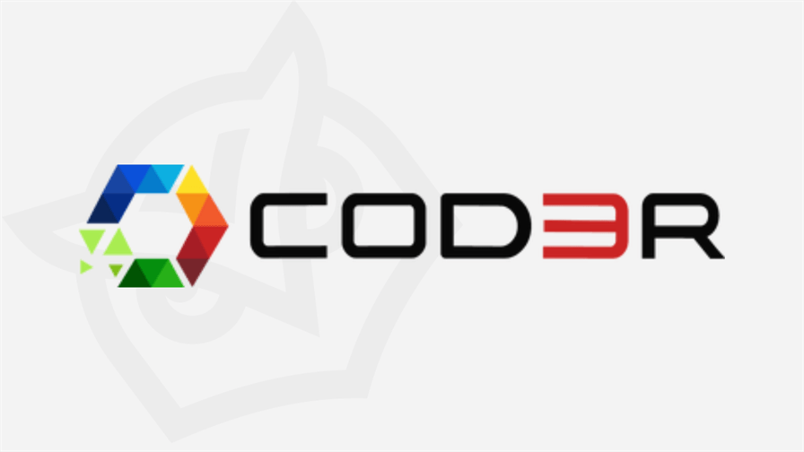
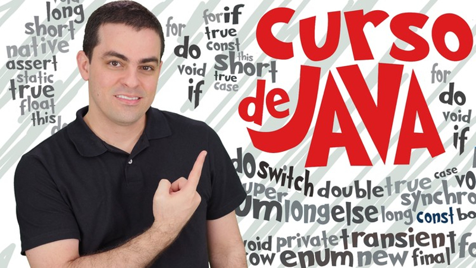

<h1 align="center">
  
  <br>
  Java 2022 COMPLETO: Do Zero ao Profissional + Projetos
</h1>

<div align="center">
  <a href="#-projeto">Projeto</a>&nbsp;&nbsp;&nbsp;|&nbsp;&nbsp;&nbsp;
  <a href="#-tecnologias">Tecnologias</a>&nbsp;&nbsp;&nbsp;|&nbsp;&nbsp;&nbsp;
  <a href="#-licença">Licença</a>&nbsp;&nbsp;&nbsp;|&nbsp;&nbsp;&nbsp;
  <a href="#-autor">Autor</a>
</div>

<br> 

<p align="center">
  
  
  
</p>

<br>

## 💻 Projeto

Curso de desenvolvimento de software com a linguagem Java completo, aborda desde os Fundamentos Iniciais de Lógica de Programação com Java, Estrutura de Controle, Classes, Métodos, Arrays, Collections, Expressões Lambdas, Stream API, Tratamentos de Erros, Banco de Dados Relacional com MySQL e Banco de Dados Não Relacional com MongoDB, JPA - Java Persistence API, Modularidade em Java, JavaFX, Spring Boot, Java Desktop com Swing, Orientação a Objetos com Polimorfismo, Abstração, Herança, entre outros. 
<br>

## 🎓 Certificado de Conclusão

<p align="center">
    
</p>

<br>

## 🚀 Tecnologias

Neste curso foi utilizada as seguintes tecnologias e ferramentas:

- [Java](https://docs.oracle.com/en/java/)
- [Spring Boot](https://spring.io/projects/spring-boot)
- [MongoDB](https://www.mongodb.com/)
- [MySQL Server](https://www.mysql.com/)
- [MySQL Workbench](https://www.mysql.com/products/workbench/)
- [Eclipse IDE](https://www.eclipse.org/downloads/)
- [JUnit 5](https://www.tutorialspoint.com/junit/index.htm)
- [Java Swing](https://www.javatpoint.com/java-swing)
- [JavaFX ...](https://www.oracle.com/br/java/technologies/javase/javafx-overview.html)


<br>

## 🔥 Executar Aplicação

### 🎇 Executando Localmente a Aplicação

Caso você deseja executar o projeto na sua máquina local, basta seguir os passos abaixo:

### 🌀 Começando...

Para começar, você deve simplesmente clonar o repositório do projeto na sua máquina.

Navegue em seu computador até o local onde você clonou o projeto, exemplo:

```sh
C:\Users\NomeDoComputador\Documents\CloneDoProjeto
```

Quando encontrar a pasta do projeto, basta acessar `cod3r-curso-java`. 

### 🛰️ Executando o projeto

<p>Bom, agora basta você importar o projeto clonado em sua IDE de preferência (Eu uso o Eclipse) e vc poderá executar cada um individualmente.
</p>

<br>

Pronto! dessa forma o projeto `cod3r-curso-java` estará rodando localmente em sua maquina.

<br>

## 🚩 Tenho Dúvidas... O que fazer?

Caso tenha dúvidas sobre o código do projeto, sintam-se a vontade em abrir uma **[ISSUE AQUI](https://github.com/Wanderson-A-Timoteo/cod3r-curso-java/issues)**. Assim que possível, responderei todas as dúvidas!

<br>

## 💡 Licença

Esse projeto está sob a licença MIT. Veja o arquivo [LICENSE](github/LICENSE.md) para mais detalhes.

<br>

## 🎆 Autor

Feito com ♥ by

-  [**Wanderson A. Timóteo**](https://www.wandersontimoteo.ga/)

<br>

## 🤝 Agradecimentos


<div align="center">
  

<br>

[Leonardo Moura Leitão](https://www.linkedin.com/in/leonardo-leit%C3%A3o-8a5813186/)
<br>

<div align="center">
    
</div>

<br>

Estudo desenvolvido durante as aulas dos cursos <br>` "Java 2022 COMPLETO - Do Zero ao Profissional + Projetos" `da plataforma de Ensino [Udemy](https://www.udemy.com/).
